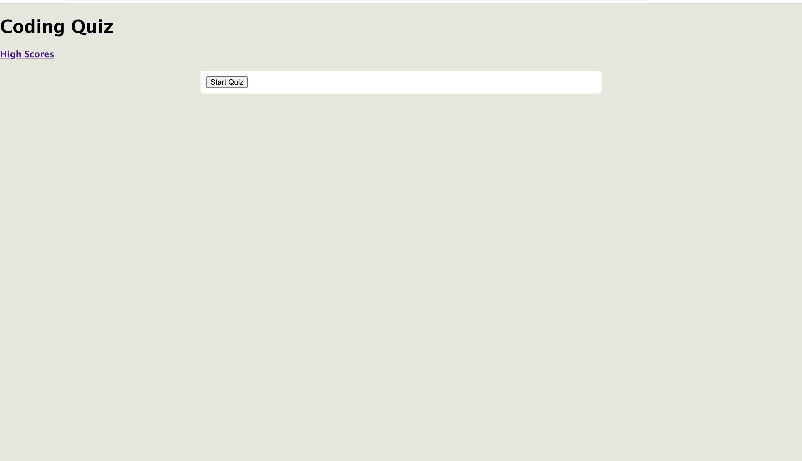
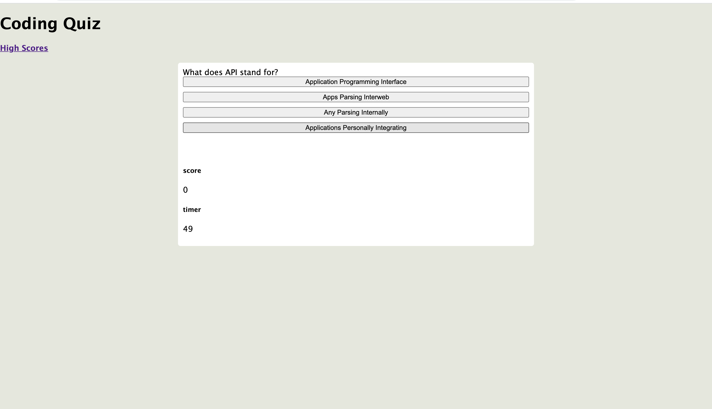

Here is my code quiz. In this exercise, I used HTML, CSS, and javascript to create a multiple choice quiz that included a timer and kept count of score. It also has a page at the end to hold the high scores.

Here is a link to my website: https://victoriahunter11.github.io/CodeQuiz/

Here are a couple different views of my code quiz:

